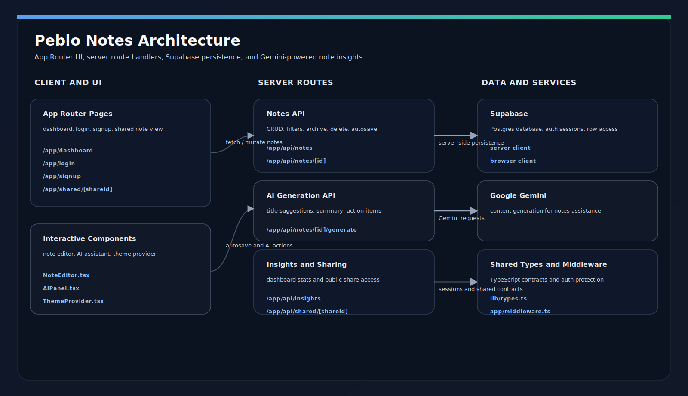

# Peblo Notes — Collaborative AI Notes Workspace

A full-stack, AI-powered notes application built for the Peblo Full Stack Developer Challenge.

## Live Demo
[[Click Here](https://smartnotes-blue.vercel.app)]

## Demo Video
[Your video link here]

## Tech Stack

| Layer | Technology |
|-------|-----------|
| Frontend | Next.js 14 (App Router), Tailwind CSS |
| Backend | Next.js API Routes |
| Database | PostgreSQL via Supabase |
| Auth | Supabase Auth |
| AI | Google Gemini 1.5 Flash |
| Deployment | Vercel + Supabase |

## Features

- **Authentication** — Secure signup/login with persistent sessions via Supabase Auth
- **Notes Workspace** — Create, edit, archive, and delete notes with auto-save
- **Tags & Categories** — Organise notes with multiple tags, filter by tag in sidebar
- **AI Integration** — Gemini-powered summaries, action item extraction, and title suggestions
- **Search & Filtering** — Full-text search across title and content, filter by tag
- **Public Sharing** — Generate shareable public links for notes, accessible without login
- **Insights Dashboard** — Stats, weekly activity chart, top tags, recently edited notes

## Architecture


### Runtime Flow

1. The user lands in the App Router UI and authentication is enforced by middleware.
2. The dashboard loads notes from the API routes, which talk to Supabase on the server.
3. `NoteEditor` autosaves note changes back to the note update route.
4. `AIPanel` requests AI-generated summaries, titles, and action items from the generate route.
5. Public share pages use the shared note route and do not require a signed-in session.

### Project Layout

- `app/` contains the routes, pages, middleware, and API handlers.
- `components/` contains the interactive client UI for editing notes, AI actions, and theme toggling.
- `lib/` contains shared types plus Supabase browser and server clients.

## Local Setup

### 1. Clone the repo
```bash
git clone https://github.com/paramcodes/smartnotes
cd peblo-notes
```

### 2. Install dependencies
```bash
npm install
```

### 3. Set up environment variables
```bash
cp .env.example .env.local
```

Fill in your values in `.env.local`:
- `NEXT_PUBLIC_SUPABASE_URL` — from Supabase project settings
- `NEXT_PUBLIC_SUPABASE_ANON_KEY` — from Supabase project settings
- `GEMINI_API_KEY` — from [Google AI Studio](https://aistudio.google.com)

### 4. Set up the database
Run the SQL from `schema.sql` in your Supabase SQL editor.

### 5. Run the app
```bash
npm run dev
```

Open [http://localhost:3000](http://localhost:3000)

## Environment Variables

| Variable | Description |
|----------|-------------|
| `NEXT_PUBLIC_SUPABASE_URL` | Supabase project URL |
| `NEXT_PUBLIC_SUPABASE_ANON_KEY` | Supabase anon public key |
| `GEMINI_API_KEY` | Google Gemini API key |

## Sample API Responses

### GET /api/notes
```json
[
  {
    "id": "uuid",
    "title": "Sprint Planning",
    "content": "Discussion notes...",
    "tags": ["work", "planning"],
    "is_public": false,
    "updated_at": "2026-05-14T12:00:00Z"
  }
]
```

### POST /api/notes/:id/generate
```json
{
  "ai_summary": "Weekly sprint planning covering UI and API tasks.",
  "ai_action_items": ["Prepare UI mockups", "Review API structure"],
  "ai_suggested_title": "Sprint Planning Notes"
}
```